# Digi Store

[Live Website](https://digi-store-pp5-4acfa738d458.herokuapp.com/)  
[Repository](https://github.com/collinsevan/DigiStore-PP5)

DigiStore is a full stack Django e-commerce application built for users to browse and purchase digital products online. The store focuses on digital downloads rather than physical goods, offering categories such as software, productivity tools, digital art, and audio books through a clean, responsive shopping experience. Users can browse products, view product details, add items to their bag, register for an account, and complete purchases through Stripe, while store owners can manage products and site content through the admin features.

---

## Responsiveness

The site was designed to provide a consistent shopping experience across desktop, tablet, and mobile devices. Responsive layout decisions were applied throughout the project to ensure that navigation, product browsing, product detail pages, bag functionality, and checkout remain clear and usable on different screen sizes.

<p align="center">
  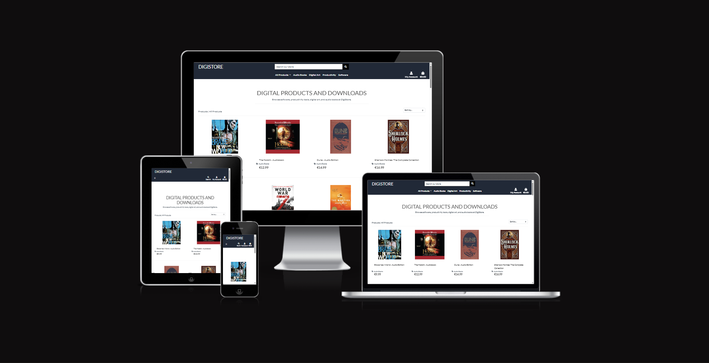
</p>

---

## Contents

- [Responsiveness](#responsiveness)
- [UX](#ux)
  - [Project Overview](#project-overview)
  - [Strategy](#strategy)
  - [Target Audience](#target-audience)
  - [User Goals](#user-goals)
  - [Site Owner Goals](#site-owner-goals)
  - [User Stories](#user-stories)
  - [Database Structure](#database-structure)
  - [Design](#design)
- [SEO and Marketing](#seo-and-marketing)
- [Testing](#testing)
- [Bugs](#bugs)
- [Existing Features](#existing-features)
- [Features Left to Implement](#features-left-to-implement)
- [Languages, Technologies and Libraries](#languages-technologies-and-libraries)
- [Credits](#credits)
- [Deployment](#deployment)
- [Acknowledgements](#acknowledgements)

---

## UX

### Project Overview

DigiStore is a full stack Django e-commerce application built as a digital-only online store. The project was created to provide users with a simple and secure way to browse and purchase digital products online through a clean and responsive interface.

Unlike a traditional e-commerce website, DigiStore focuses entirely on digital products rather than physical items. The store is designed around downloadable product categories including software, productivity tools, digital art, and audio books, making it easy for users to browse a varied catalogue of digital content in one place.

The site allows users to search the catalogue, browse products by category, view individual product details, add items to their bag, and complete purchases through Stripe. Authenticated users can also register for an account, access profile features, and interact with product suggestion features, helping to create a smoother experience for returning customers.

From the business side, DigiStore also provides product management features for the store owner, including the ability to add, edit, and delete products, as well as review product suggestions submitted by users. This supports both customer usability and practical store administration within the same application.

The project was developed as Portfolio Project 5 for the Code Institute Full Stack Software Development Diploma and was designed to demonstrate full stack development skills, relational database design, CRUD functionality, responsive design, payment integration, and e-commerce best practices.

<p align="center">
  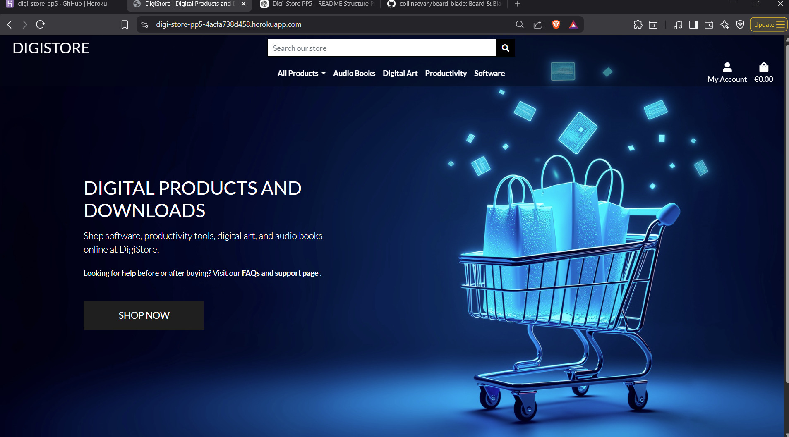
</p>

### Strategy

The strategy behind DigiStore was to create a digital-only e-commerce store with a clear and familiar shopping flow. The application was designed so that users can land on the homepage, understand the purpose of the site quickly, move into the catalogue, explore products, and complete purchases with as little friction as possible.

A key part of the project strategy was to organise the store around clear digital product categories. This makes the site easier to understand and improves product discovery for users who want to browse software, productivity tools, digital art, and audio books in a structured way.

Another strategic goal was to support both customer and store-owner needs within the same application. Customers can browse and purchase products, while the store owner can manage the catalogue and review product suggestions through dedicated product management views.

<p align="center">
  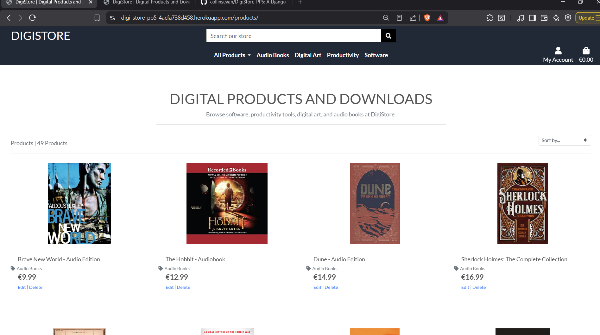
</p>

### Target Audience

DigiStore is aimed at users who want a simple way to browse and purchase digital products online. The target audience includes customers looking for downloadable products such as audio books, digital art, software, and productivity tools.

The site is also intended for users who value a clean and straightforward shopping experience, including clear navigation, visible product categories, easy-to-use product pages, and a familiar bag and checkout flow.

From a business perspective, the application is also designed for a store owner who needs practical product management features in order to maintain the catalogue and respond to user interest through product suggestions.

### User Goals

The main user goals for DigiStore were:

- to understand the purpose of the site immediately on arrival
- to browse products quickly and clearly
- to search and filter products with ease
- to view product details before purchasing
- to add products to a shopping bag and proceed to checkout
- to create an account and use profile features
- to submit product suggestions for future store additions

Users can achieve these goals through a clear product detail page, a familiar shopping bag layout, and a secure checkout process.

<p align="center">
  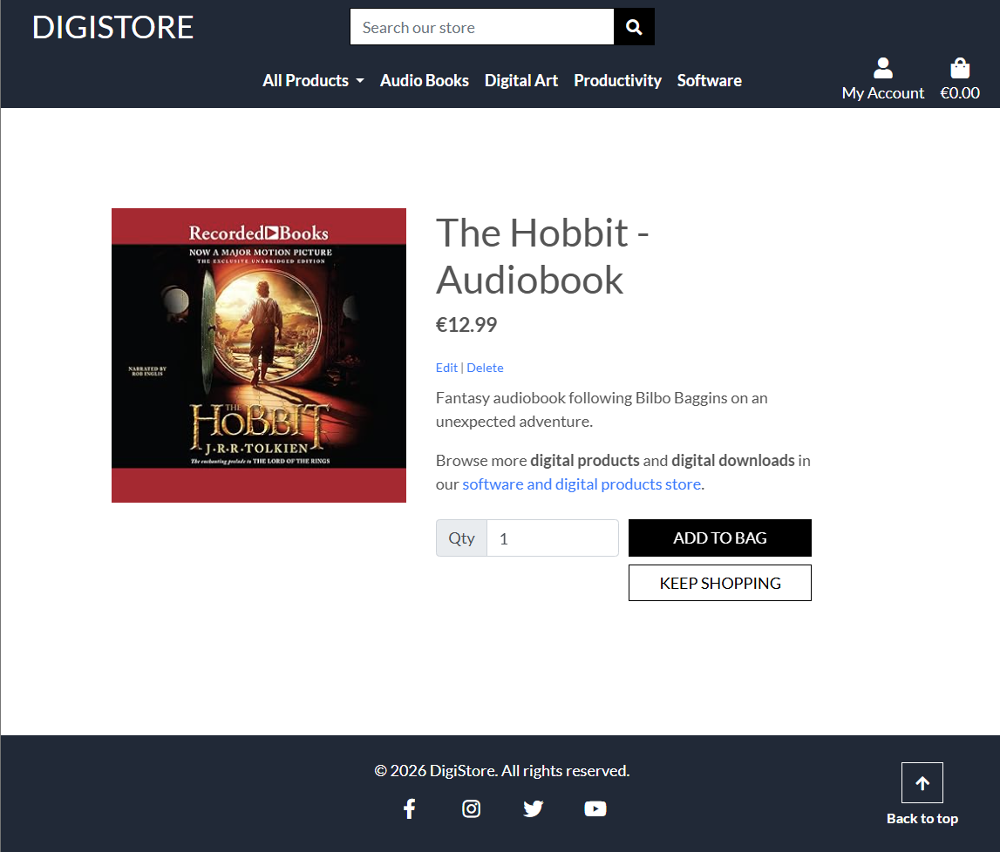
  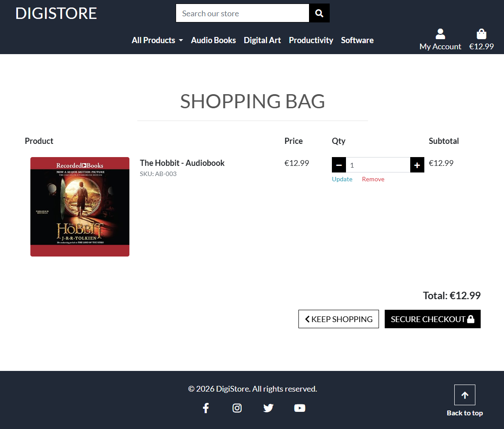
  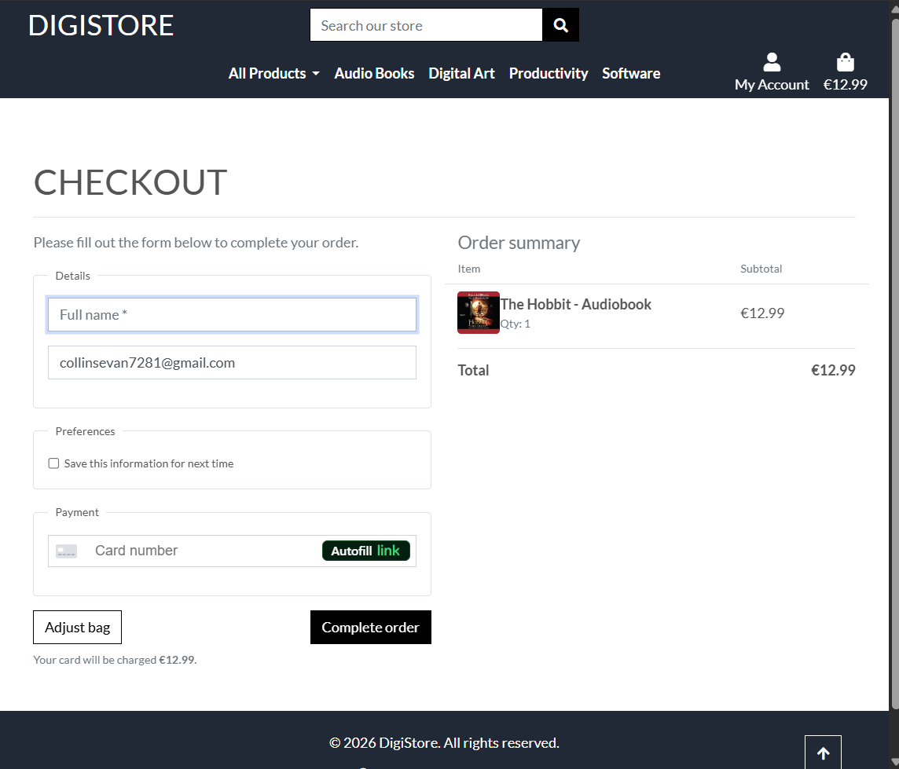
</p>

<p align="center">
  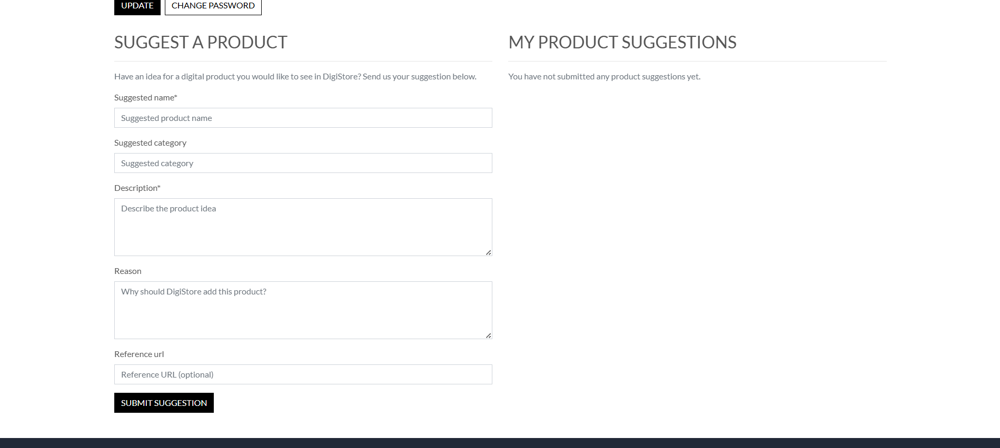
</p>

### Site Owner Goals

The main site owner goals were to create a professional digital storefront while also making it practical to manage products behind the scenes. As well as providing a customer-facing catalogue and purchase flow, DigiStore was built to support core store administration tasks.

These goals included allowing the store owner to add new products, update existing products, delete products when needed, and manage product suggestions submitted by users. This helps keep the catalogue current and makes the store feel more complete as an e-commerce project.

The product management area was designed to act as a central hub for these actions, making it easier for the store owner to maintain the site without relying only on the Django admin panel.

<p align="center">
  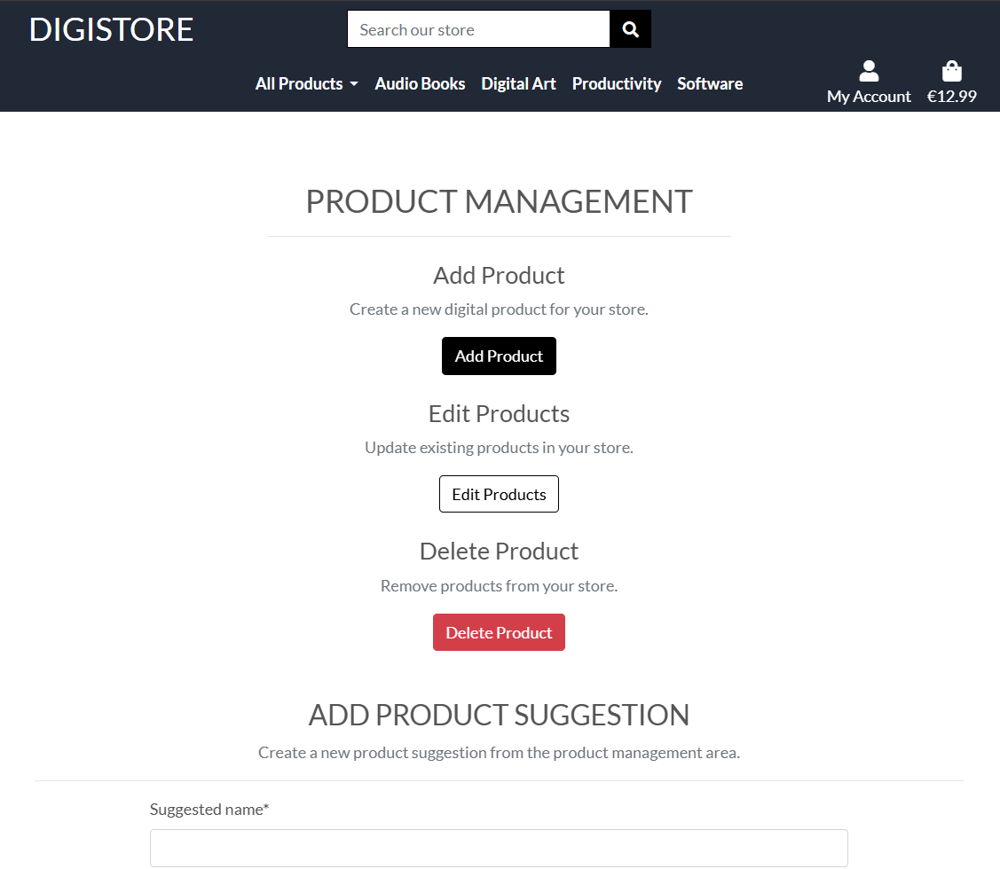
  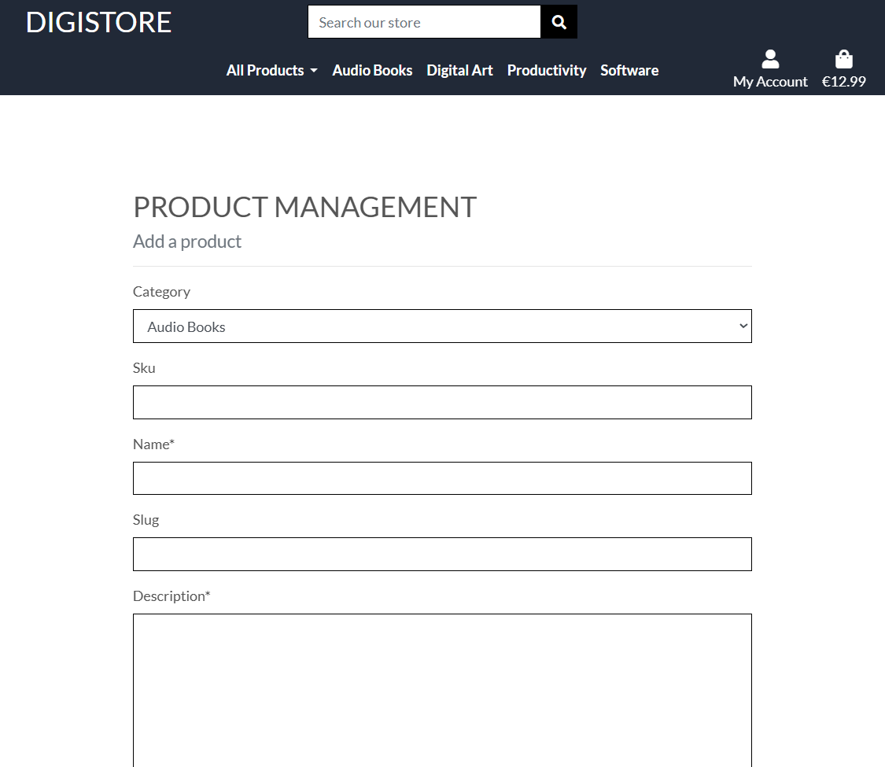
  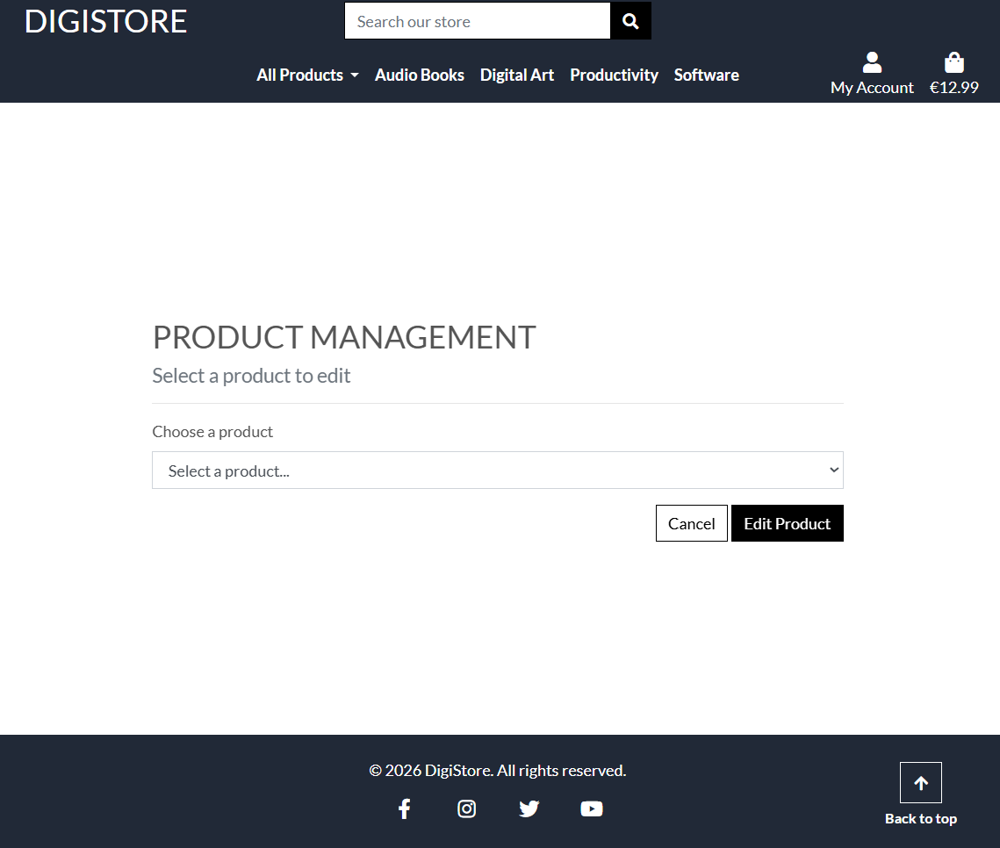
</p>

<p align="center">
  
</p>

### User Stories

The project was planned using GitHub Projects and user stories to guide development. This helped break the build into manageable tasks and ensured that both user-facing and admin-facing features were planned with purpose.

The board below shows completed work such as user registration, login and logout, browsing products by category, checkout with Stripe, viewing product details, adding products to cart, product suggestions, and admin product management features.

<p align="center">
  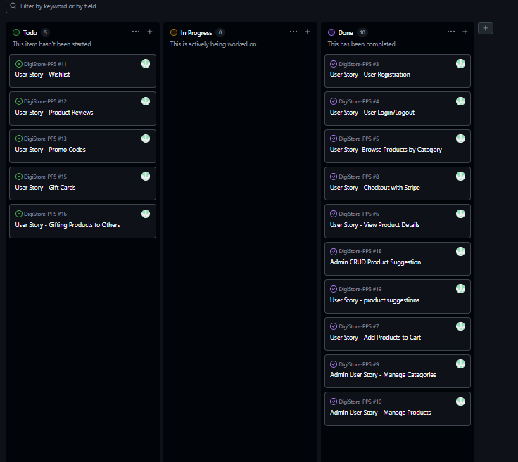
</p>

### Database Structure

DigiStore uses a relational database structure to support product browsing, user accounts, checkout functionality, and product suggestion management.

The database design includes models for products and categories, user profile information, orders and line items, and product suggestions. These relationships allow the store to support both customer shopping functionality and store-owner management features.

An ERD for the project will be included below.

<p align="center">
  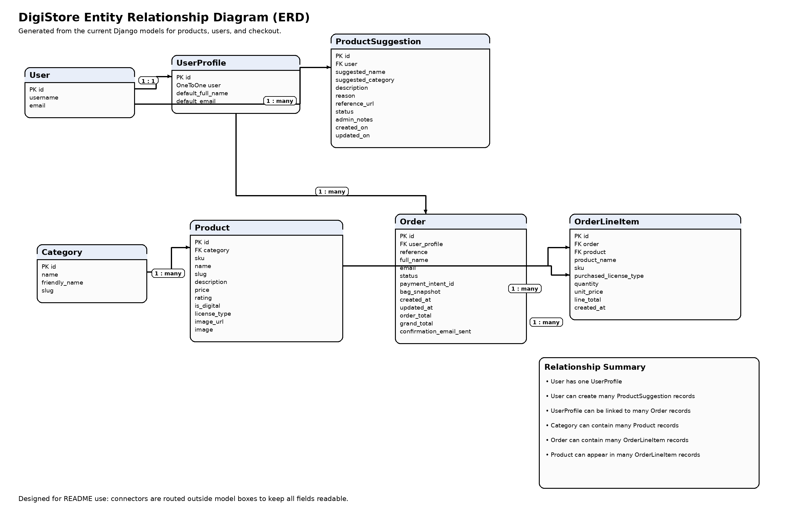
</p>

### Design

The design of DigiStore focuses on a clean, modern, and professional e-commerce layout. A dark header and footer are used to frame the site, while light content areas improve readability and make product information easier to scan.

The homepage uses a visually stronger hero section to immediately communicate that DigiStore is a digital storefront. Across the rest of the site, the layout becomes more neutral and content-focused so that product cards, forms, and checkout information remain easy to read.

The overall design was kept simple so users could focus on browsing, selecting, and purchasing products without unnecessary distractions. Consistent button styles, spacing, and typography were used throughout the site to support a cohesive experience.

<p align="center">
  
  
</p>

### Wireframes

Low-fidelity wireframes were used to plan the main layout patterns of DigiStore before and during development. The aim was to keep the structure clear and user-focused, with familiar e-commerce conventions such as a consistent header, visible navigation, product-first content areas, and a simple purchase flow.

The homepage wireframe focused on introducing the store clearly, using a strong hero area, a call to action, and supporting sections to guide users into browsing the catalogue.

<p align="center">
  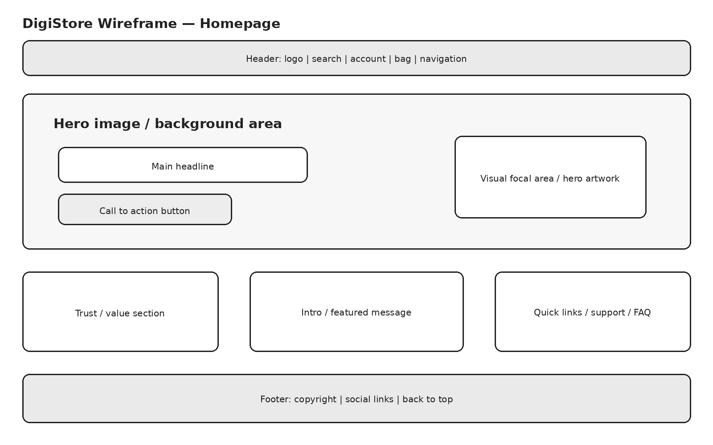
</p>

The products page wireframe was designed around a clear browsing experience, with category context, sorting controls, and a responsive product card grid that allows users to scan multiple items quickly.

<p align="center">
  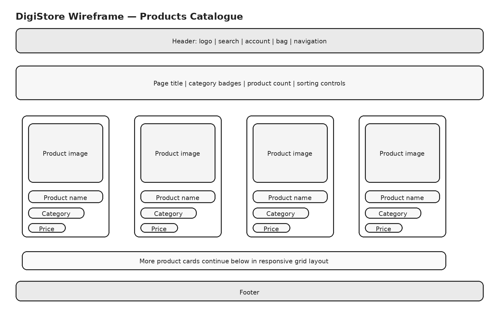
</p>

The product detail and management wireframe shows the clean single-page structure used for product information and action-focused layouts. This same pattern also supports store owner flows such as add product, edit product, and suggestion review pages.

<p align="center">
  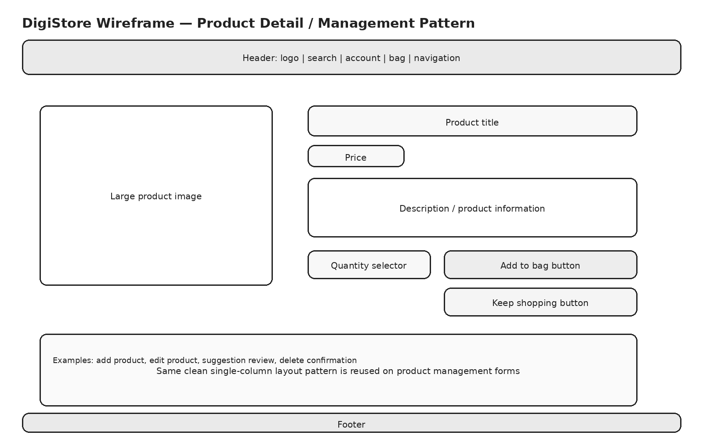
</p>

### Colour Scheme

The DigiStore colour scheme was designed to create a clean and professional e-commerce experience with strong contrast between key layout areas.

A dark header and footer are used to frame the site and strengthen branding, while light content backgrounds help product information, forms, and page content remain easy to read. This balance supports both visual clarity and a more polished storefront appearance.

Neutral tones are used throughout the main interface, with darker button styles for primary actions and lighter backgrounds for product cards, forms, and general content areas. Accent colours are used more sparingly for hover states, feedback styling, and interactive elements so that the interface remains clear without becoming visually cluttered.

This approach was chosen to keep the focus on the digital products themselves while still giving the site a distinctive and consistent look across the homepage, product pages, profile area, and product management sections.

The main colours used in the project include:

- `#1F2937` for the main header background
- `#111827` for the footer background
- `#FFFFFF` for page backgrounds and card areas
- `#2B2B2B` for hover states and darker button interactions
- `#93C5FD` for accent hover highlights
- `#6C757D` for muted text and supporting copy

<p align="center">
  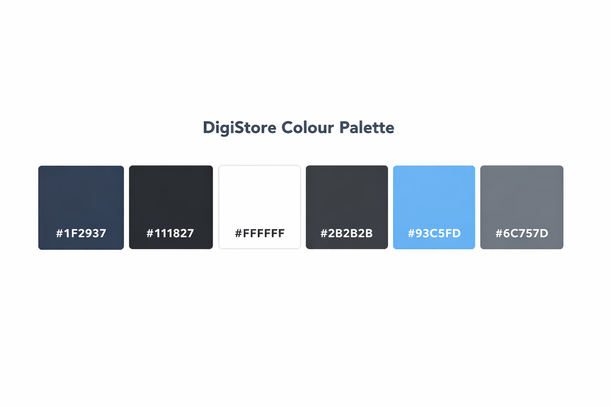
</p>
---

## SEO and Marketing

### SEO

Search engine optimisation was implemented to improve the visibility, structure, and crawlability of the DigiStore website. The project uses a combination of technical SEO foundations and on-page content improvements to help search engines understand the purpose of the site and its individual pages.

A reusable SEO structure was added through the base template, including meta description and meta keyword blocks, as well as canonical links. This allows the site to provide a default SEO foundation across pages while also supporting more specific SEO content on key templates such as the products page and product detail pages.

The products page includes targeted copy describing the digital catalogue, while individual product detail pages generate more specific meta content based on the product being viewed. This helps make category and product pages more relevant to search intent and supports better page indexing.

Technical SEO was also implemented through a live `robots.txt` file and a working `sitemap.xml`, helping search engines crawl the website more effectively. The sitemap includes important site URLs and product pages, while the robots file directs crawlers to the sitemap location.

<p align="center">
  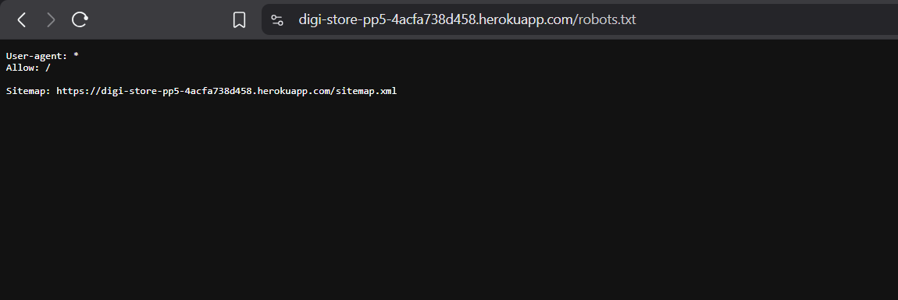
</p>

<p align="center">
  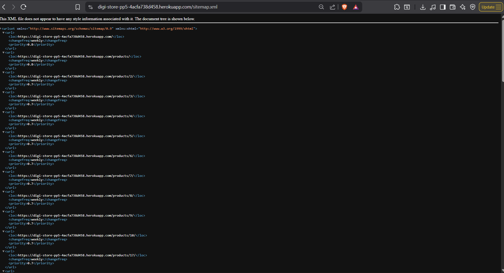
</p>

The screenshots below show the main catalogue and homepage content that support keyword targeting and page relevance for search engines.

<p align="center">
  
  
</p>

### Marketing

The marketing approach for DigiStore was planned around presenting the business as a digital-only online store with a clear and focused niche. The project targets users looking for downloadable products such as software, productivity tools, digital art, and audio books, and the content across the site reflects those product types consistently.

The homepage was designed to communicate the store purpose immediately through a clear headline, supporting copy, and a direct call to action. Product categories are also visible in the main navigation, helping guide users toward relevant sections of the store quickly and supporting both usability and discoverability.

A Facebook business mockup was planned as part of the project marketing materials and will be added to this section. This was intended to represent how the brand could be promoted through social media in a realistic e-commerce context.

Newsletter marketing was also considered as part of the wider promotional strategy for encouraging repeat visits and future customer engagement.

---

## Testing

Testing for DigiStore was carried out throughout development to ensure that the application works as expected for both customers and the store owner. The project was tested manually across the main user flows, including browsing products, searching and sorting the catalogue, using the shopping bag, completing checkout, managing an account, and carrying out store owner product management tasks. The site was also reviewed for responsiveness, usability, and general reliability across different screen sizes and feature areas.

### Testing Approach

The project was tested using a combination of manual feature testing, user story testing, responsive checks, and general validation of page behaviour. This approach was chosen because it allowed the application to be assessed in the same way that a real user or examiner would interact with it. Rather than only confirming that pages loaded, testing focused on whether the features behaved correctly from the user’s point of view.

Testing was carried out under different user conditions where relevant, including guest users, authenticated users, and superusers. This was particularly important for DigiStore because some features are public, some are available only to logged-in users, and others are restricted to the store owner. Examples include browsing products as a guest, accessing profile and order history as an authenticated user, and using product management tools as a superuser.

### Manual Testing

Manual testing was used to verify the key interactive flows within the site. Each feature was tested by performing the full action in the browser and checking that the expected result appeared on screen.

Examples of areas manually tested included:

- navigation links and page routing
- product browsing and category filtering
- search and sorting behaviour
- product detail page display
- add to bag functionality
- bag updates and totals
- checkout flow and payment handling
- account registration, login, and logout
- profile and order history access
- product suggestion submission
- superuser product CRUD functionality
- superuser suggestion management

These tests helped confirm that DigiStore works as a coherent e-commerce application rather than as a collection of isolated pages.

### Responsive Testing

Responsive testing was carried out to confirm that the site remains usable and visually clear on desktop, tablet, and mobile screen sizes. This included checking the header, navigation, product grid, footer, forms, shopping bag, checkout pages, and management pages. The aim was to ensure that content stayed readable, buttons remained accessible, and layouts adapted appropriately across smaller breakpoints. This supported the overall project goal of delivering a consistent shopping experience across devices.

### User Story Testing

The project was planned using GitHub Projects and user stories, and the completed application was tested against those stories to confirm that the intended goals were met. This was important because the user stories shaped both the customer-facing experience and the store owner functionality. The testing below shows how the completed features were checked against the main user and business needs identified during planning.

#### As a user, I want to register for an account so that I can access personal features

This was tested by opening the registration page, submitting a new account with valid details, and confirming that the account could be created successfully. After registration, the user could sign in and access authenticated features such as the profile area. This confirmed that account creation was working as expected.

**Expected result:** A new account can be created successfully and the user can access logged-in features.  
**Outcome:** Passed.

<p align="center">
  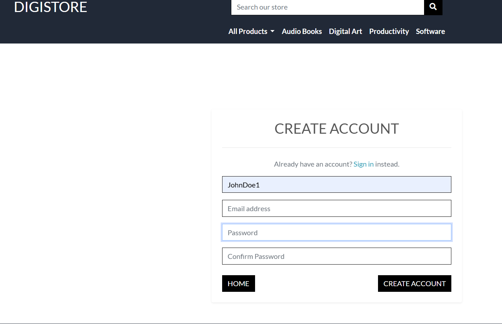
</p>

#### As a user, I want to log in and log out so that I can securely access my account

This was tested by logging in with valid credentials and checking that the navigation changed to show the correct authenticated account options. Logout was then tested to confirm that the session ended correctly and guest navigation options returned.

**Expected result:** Users can log in securely, access their account area, and log out again without issues.  
**Outcome:** Passed.

<p align="center">
  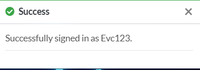
  
</p>

#### As a user, I want to browse all products so that I can see what is available in the store

This was tested by opening the products page and reviewing the product listing layout. Product cards were checked to ensure that they displayed key information clearly, including the product name, image, category, and price.

**Expected result:** The full product catalogue is visible and easy to browse.  
**Outcome:** Passed.

<p align="center">
  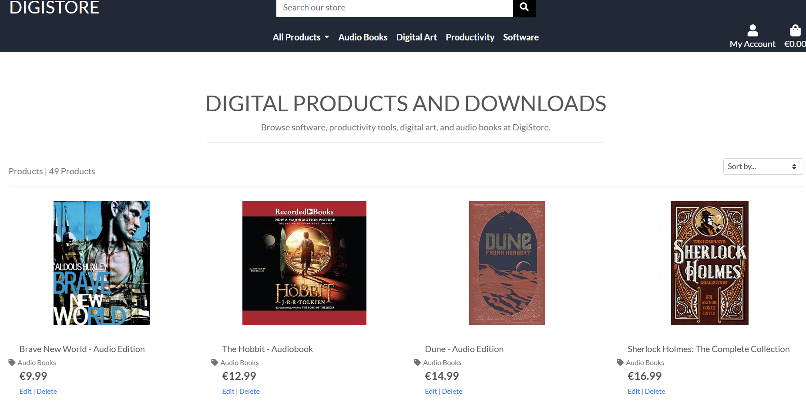
</p>

#### As a user, I want to browse products by category so that I can narrow my search

This was tested by using the category navigation links for Audio Books, Digital Art, Productivity, and Software. Each category page was checked to confirm that only relevant products were shown.

**Expected result:** Product listings update to reflect the selected category.  
**Outcome:** Passed.

<p align="center">
  
</p>

#### As a user, I want to search for products so that I can find relevant items quickly

This was tested by entering search terms into the search bar and confirming that matching products were returned based on the search input. Search behaviour was also checked when invalid or empty searches were attempted.

**Expected result:** Relevant products appear for valid search terms and the user receives feedback where appropriate.  
**Outcome:** Passed.

<p align="center">
  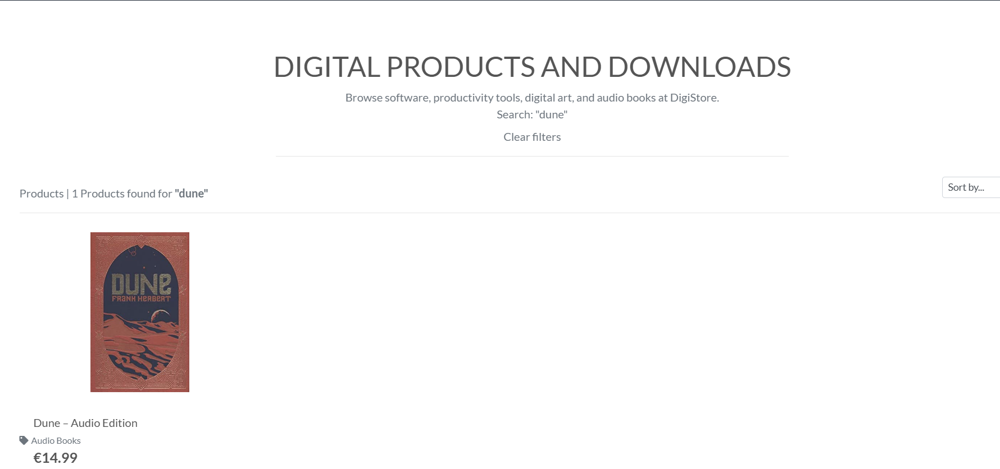
</p>

#### As a user, I want to sort products so that I can organise the catalogue in a useful way

This was tested using the sort selector on the products page. Sorting by price, category, and name was checked to confirm that the visible product order updated correctly.

**Expected result:** Products reorder according to the selected sort option.  
**Outcome:** Passed.

<p align="center">
  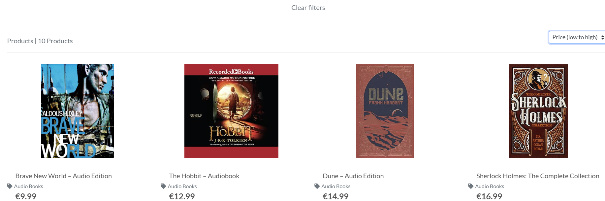
  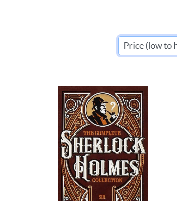
</p>

#### As a user, I want to view product details so that I can read more before purchasing

This was tested by opening individual product detail pages from the catalogue and checking that the correct title, image, description, and price were displayed.

**Expected result:** Each product opens on its own detail page with the correct information shown.  
**Outcome:** Passed.

<p align="center">
  
</p>

#### As a user, I want to add products to my bag so that I can prepare for checkout

This was tested by adding products from the detail page to the bag and confirming that the bag updated correctly. Product quantity and bag total behaviour were also checked.

**Expected result:** Products are added to the bag correctly and totals update as expected.  
**Outcome:** Passed.

<p align="center">
  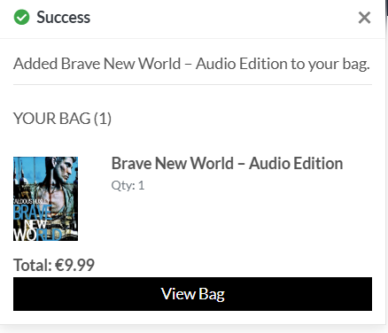
</p>

#### As a user, I want to view my shopping bag so that I can review selected products before checkout

This was tested by opening the shopping bag and confirming that the selected product, quantity controls, subtotal, and total were displayed correctly.

**Expected result:** The shopping bag displays the selected product and updated totals correctly.  
**Outcome:** Passed.

<p align="center">
  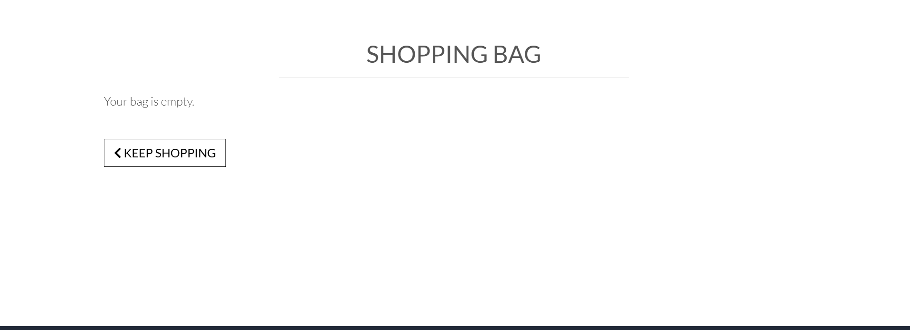
</p>

#### As a user, I want to complete checkout securely so that I can purchase digital products online

This was tested by progressing through the checkout flow, entering the required information, submitting payment through Stripe, and confirming that successful orders reached the correct confirmation stage.

**Expected result:** Users can complete the checkout flow successfully and receive order confirmation.  
**Outcome:** Passed.

<p align="center">
  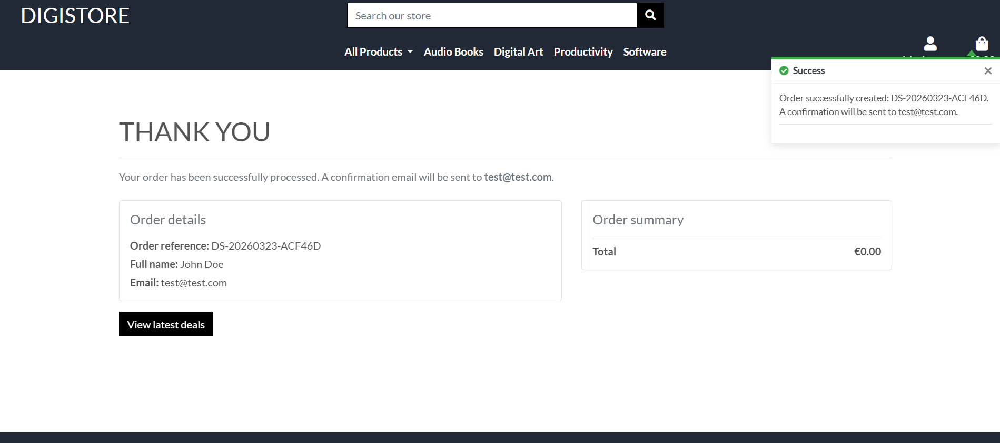
</p>

#### As an authenticated user, I want to access my profile and order history so that I can review my account activity

This was tested by logging in, opening the profile page, and checking that profile-related information and previous order details could be accessed correctly.

**Expected result:** Logged-in users can access their profile area and review order history.  
**Outcome:** Passed.

<p align="center">
  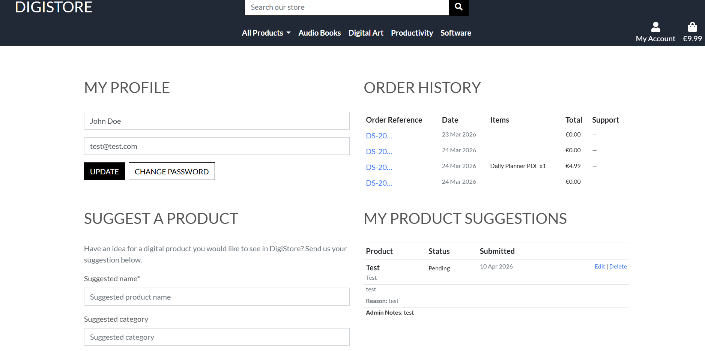
</p>

<p align="center">
  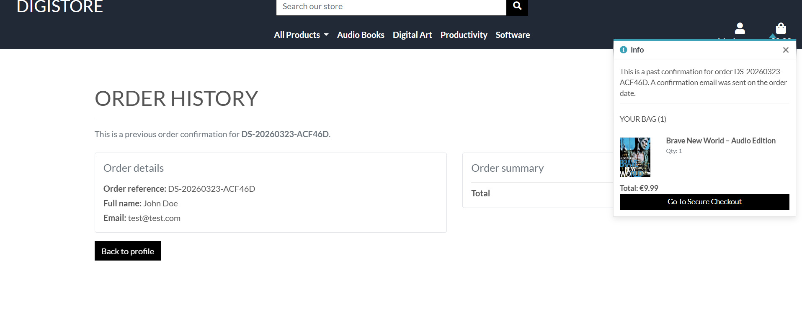
</p>

#### As an authenticated user, I want to submit product suggestions so that I can recommend future store additions

This was tested by completing the product suggestion form and confirming that the suggestion was stored successfully for later review by the store owner. The suggestion could then be viewed and edited from the user profile area, showing that the feature worked beyond the initial form submission.

**Expected result:** Product suggestions can be submitted and saved successfully.  
**Outcome:** Passed.

<p align="center">
  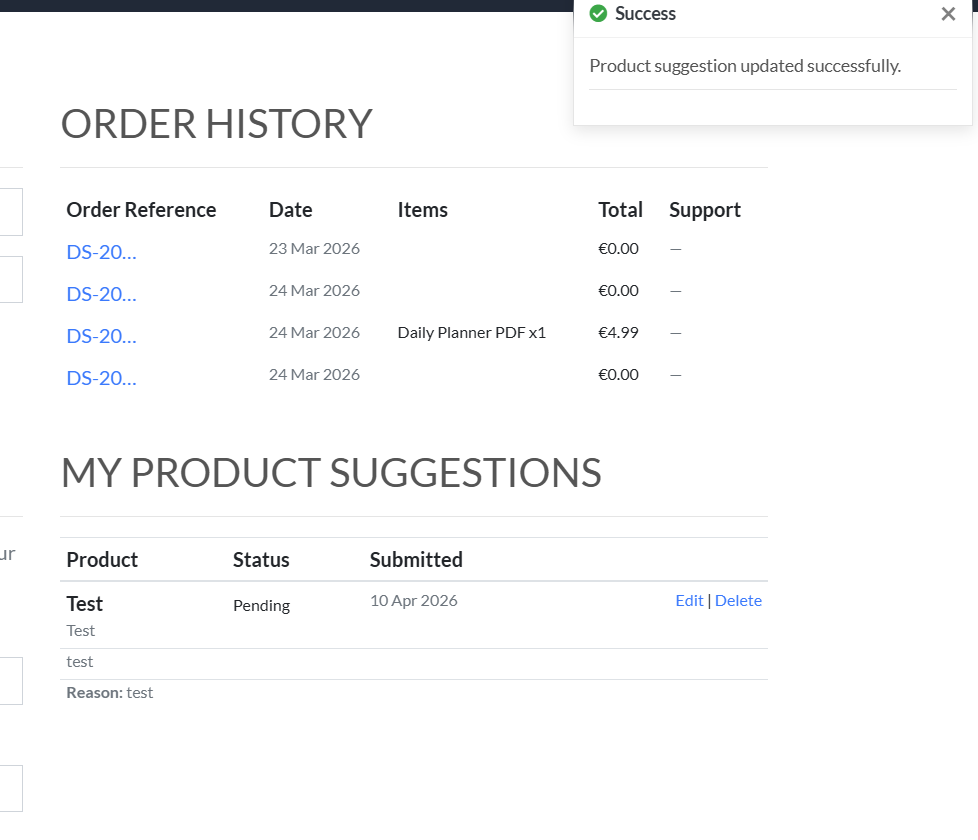
</p>

<p align="center">
  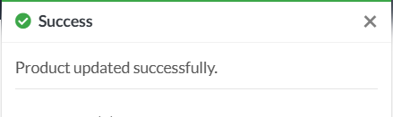
</p>

<p align="center">
  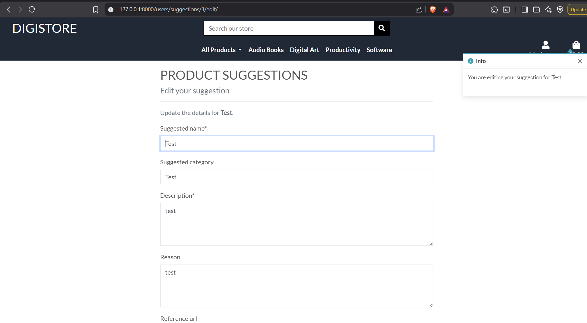
</p>

#### As a store owner, I want to add products so that I can expand the catalogue

This was tested by logging in as a superuser, opening the product management area, completing the add product form, and confirming that the new product appeared in the catalogue.

**Expected result:** Superusers can create new products successfully.  
**Outcome:** Passed.

<p align="center">
  
  
</p>

#### As a store owner, I want to edit products so that I can keep product information up to date

This was tested by selecting an existing product from the edit flow, updating its details, and confirming that the changes were reflected correctly on the site.

**Expected result:** Superusers can edit existing products successfully.  
**Outcome:** Passed.

<p align="center">
  
  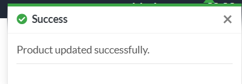
</p>

#### As a store owner, I want to delete products so that I can remove products when needed

This was tested by selecting a product from the delete flow, confirming deletion, and checking that the item was removed from the catalogue.

**Expected result:** Superusers can delete products successfully.  
**Outcome:** Passed.

<p align="center">
  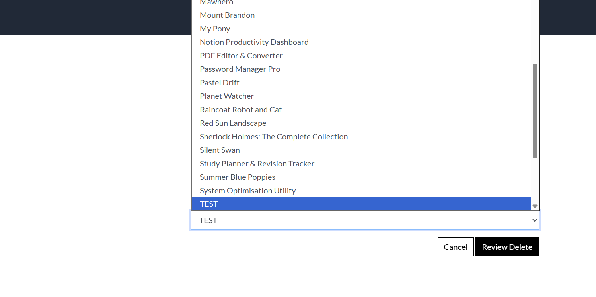
  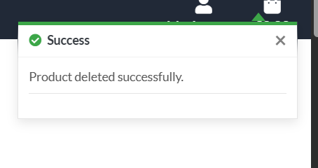
</p>

#### As a store owner, I want to review and manage product suggestions so that I can respond to user interest

This was tested by accessing the product suggestion management area as a superuser, reviewing submitted suggestions, editing suggestion details, deleting suggestions, and using the create-product-from-suggestion flow.

**Expected result:** Superusers can review, update, delete, and use suggestions in the management area.  
**Outcome:** Passed.

<p align="center">
  
  
</p>

<p align="center">
  
</p>

#### As a store owner, I want to review and manage product suggestions so that I can respond to user interest

This was tested by accessing the product suggestion management area as a superuser, reviewing submitted suggestions, editing suggestion details, deleting suggestions, and using the create-product-from-suggestion flow.

**Expected result:** Superusers can review, update, delete, and use suggestions in the management area.  
**Outcome:** Passed.

<p align="center">
  
</p>

### Accessibility and Lighthouse Testing

Accessibility and Lighthouse testing were carried out on the live deployed DigiStore application using Google Lighthouse in Chrome DevTools. The main customer-facing and store-owner pages were tested on the Heroku deployment to assess performance, accessibility, best practices, and SEO.

The results showed strong accessibility, best practices, and SEO scores across the site, with performance varying depending on the page content and functionality being loaded at the time of testing. The screenshots below provide evidence of the Lighthouse results gathered from the live application.

While the Lighthouse results were strong overall, a small number of pages returned slightly lower accessibility scores, falling just below 90 rather than achieving a full green result. These issues were minor rather than critical, and the tested pages still remained usable, responsive, and passed the main accessibility checks overall.

Some pages also showed lower performance scores than others. This was influenced in part by the deployed environment and external asset loading, particularly the live hosting and cloud-based static/media setup through AWS, which can affect Lighthouse performance results compared with local testing. As a result, performance scores on certain pages were lower than the accessibility, best practices, and SEO scores.

Due to project time constraints, I prioritised completing the core functionality, testing evidence, deployment, and pass criteria requirements rather than carrying out another full round of performance and accessibility refinement on the small number of pages that scored lower. Even so, the overall Lighthouse results were positive, with strong scores across the application and particularly high results in best practices and SEO.

#### Home page — Passed  
`https://digi-store-pp5-4acfa738d458.herokuapp.com/`

<p align="center">
  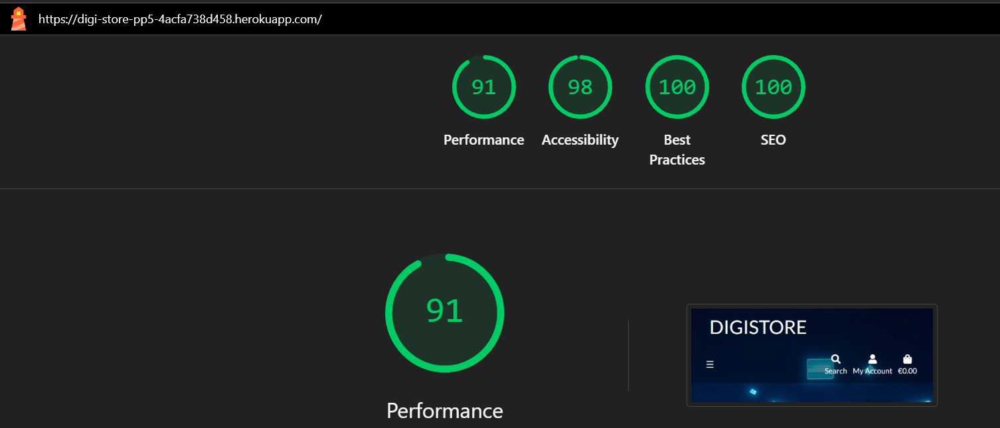
</p>

#### Products page — Passed  
`https://digi-store-pp5-4acfa738d458.herokuapp.com/products/`

<p align="center">
  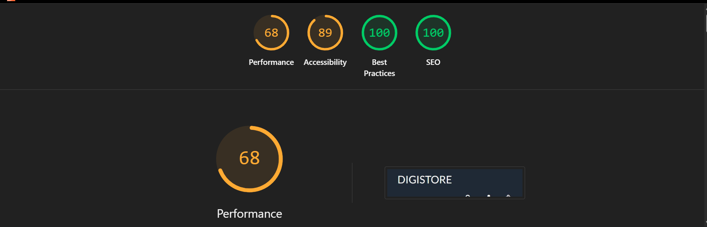
</p>

#### Product detail page — Passed  
`https://digi-store-pp5-4acfa738d458.herokuapp.com/products/2/`

<p align="center">
  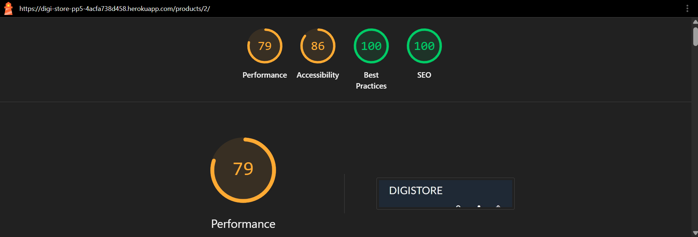
</p>

#### Shopping bag page — Passed  
`https://digi-store-pp5-4acfa738d458.herokuapp.com/bag/`

<p align="center">
  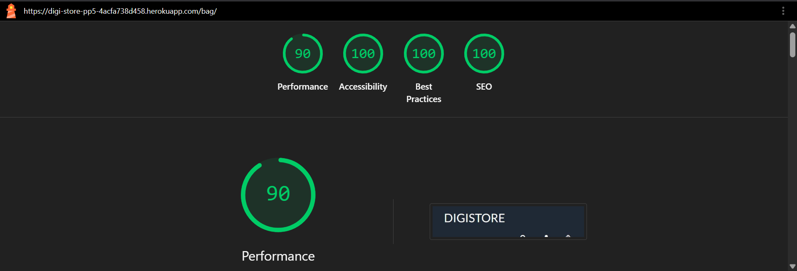
</p>

#### Checkout page — Passed  
`https://digi-store-pp5-4acfa738d458.herokuapp.com/checkout/`

<p align="center">
  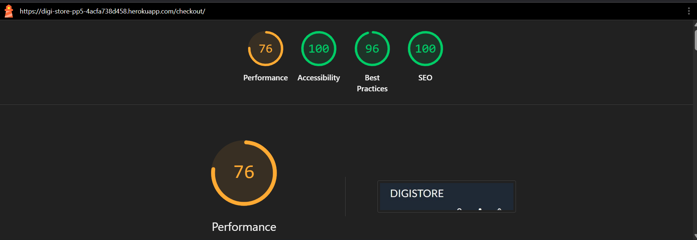
</p>

#### Profile page — Passed  
`https://digi-store-pp5-4acfa738d458.herokuapp.com/users/profile/`

<p align="center">
  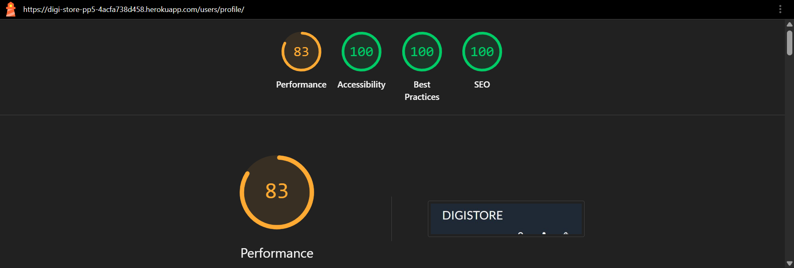
</p>

#### Product management page — Passed  
`https://digi-store-pp5-4acfa738d458.herokuapp.com/products/management/`

<p align="center">
  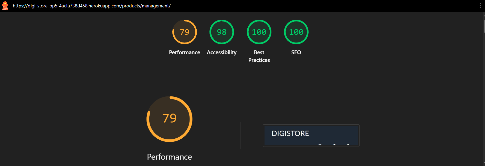
</p>

#### Add product page — Passed  
`https://digi-store-pp5-4acfa738d458.herokuapp.com/products/add/`

<p align="center">
  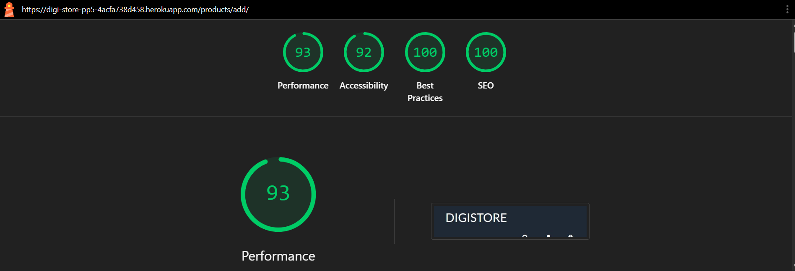
</p>

#### Edit product selection page — Passed  
`https://digi-store-pp5-4acfa738d458.herokuapp.com/products/edit/`

<p align="center">
  
</p>

#### Edit product page — Passed  
`https://digi-store-pp5-4acfa738d458.herokuapp.com/products/edit/32/`

<p align="center">
  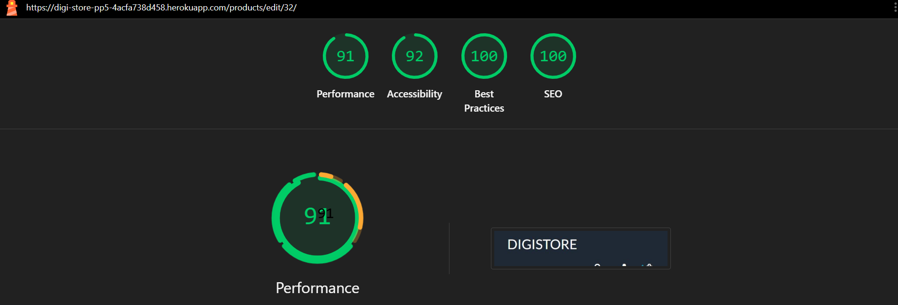
</p>

#### Delete product selection page — Passed  
`https://digi-store-pp5-4acfa738d458.herokuapp.com/products/delete/`

<p align="center">
  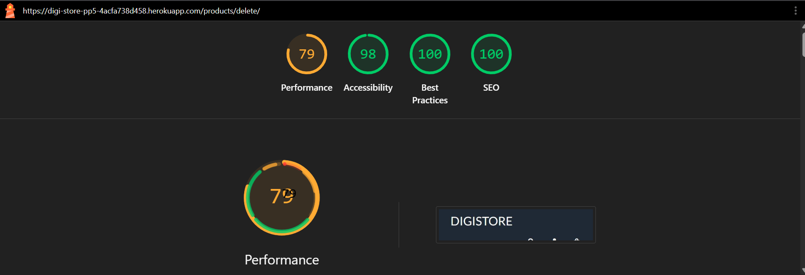
</p>

#### Delete product page — Passed  
`https://digi-store-pp5-4acfa738d458.herokuapp.com/products/delete/4/`

<p align="center">
  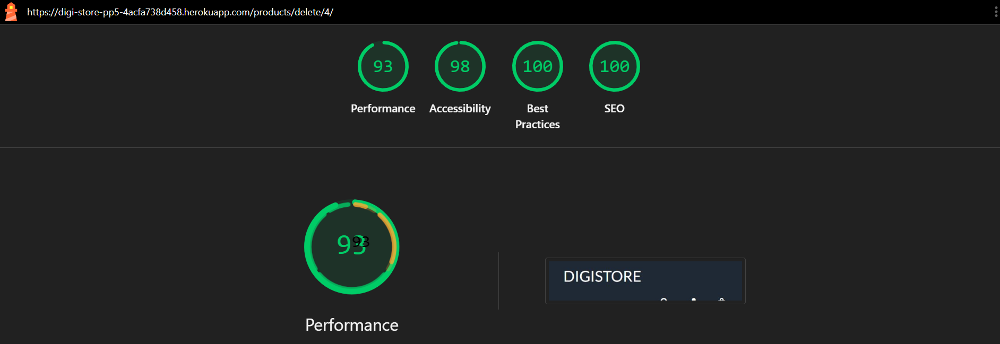
</p>

#### Profile page with product suggestions — Passed  
`https://digi-store-pp5-4acfa738d458.herokuapp.com/users/profile/`

<p align="center">
  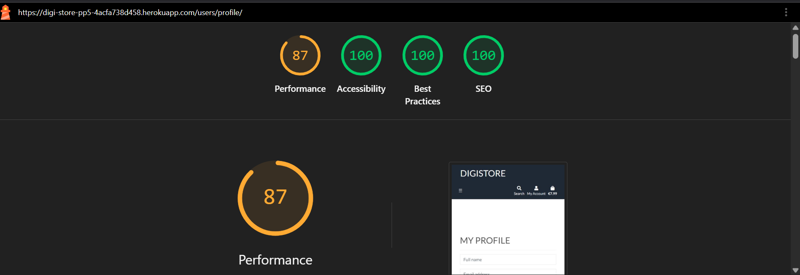
</p>

Overall, the Lighthouse results showed that DigiStore performs well across the key live pages of the application, with especially strong scores in accessibility, best practices, and SEO. This supports the goal of delivering a responsive, usable, and accessible digital e-commerce experience for both customers and store owners.

---

### Validation

The project was also checked for general page behaviour and content presentation. This included confirming that templates rendered correctly, navigation links worked, forms displayed properly, and key user journeys could be completed without broken flow. Validation and code quality checks were used during development to support a cleaner final submission, alongside repeated browser-based testing of interactive features.

### Bugs and Fixes During Testing

A number of issues were identified and improved during development through repeated testing. These included layout and responsive issues, product management routing issues, image upload feedback improvements, header and footer alignment adjustments, and deployment-related static file troubleshooting. Addressing these issues helped improve the usability, structure, and reliability of the final project.

### Overall Testing Summary

Overall, testing confirmed that DigiStore delivers the core functionality expected of a digital e-commerce application. Users can browse products, search and sort the catalogue, view product details, add products to their bag, create an account, log in, complete checkout, and use profile-related features. The store owner can also manage products and review product suggestions through dedicated management areas. Together, these results show that the final project meets its intended goals as a full stack Django e-commerce application.

---
---

## Bugs

---

## Existing Features

DigiStore includes a range of user-facing and store-owner features designed to create a complete digital e-commerce experience.

### General Site Features

- Responsive layout designed for desktop, tablet, and mobile browsing
- Consistent header, navigation, and footer structure across the site
- Homepage hero section with clear store messaging and a call to action
- Product-focused layout designed to keep browsing and purchasing straightforward
- Back to top functionality in the footer
- Social media links in the footer
- Clear visual hierarchy through consistent spacing, typography, and button styling

### User Account Features

- User registration through Django Allauth
- User login and logout functionality
- Profile area for authenticated users
- Automatic user profile creation when a user account is created
- Saved default user information through the user profile model
- Order history available through the user profile section

### Product Browsing Features

- Dedicated products page displaying the full digital catalogue
- Category-based browsing for:
  - Audio Books
  - Digital Art
  - Productivity
  - Software
- Search functionality for product names and descriptions
- Product sorting options, including:
  - Price
  - Category
  - Name
- Product detail pages with:
  - Product image
  - Product title
  - Price
  - Description
  - Quantity selector
  - Add to bag functionality
  - Keep shopping action

### Bag and Checkout Features

- Shopping bag page showing selected items
- Quantity adjustment controls inside the bag
- Remove item functionality
- Bag total calculation
- Stripe checkout integration
- Order summary shown during checkout
- Save information option for returning authenticated users
- Order creation and storage after successful payment
- Order line item storage linked to products and orders
- Unique order reference generation
- Order totals calculated automatically from line items
- Stripe webhook handling for successful and failed payments
- Order confirmation email workflow

### Product Suggestion Features

- Authenticated users can submit product suggestions
- Suggestion form allows users to provide:
  - Suggested product name
  - Suggested category
  - Description
  - Reason
  - Optional reference URL
- Users can view their own product suggestion area within the profile page
- Suggestions provide a useful interaction feature beyond purchasing

### Store Owner Features

- Superuser-only product management access
- Dedicated product management page for store owners
- Add product form
- Edit product selection page
- Edit product form
- Delete product selection page
- Delete product confirmation page
- Ability to create a product suggestion from the management area
- Ability to review submitted product suggestions
- Ability to edit product suggestions
- Ability to delete product suggestions
- Ability to create a product directly from an approved suggestion
- Prefilled product creation flow from suggestions
- Automatic suggestion status updates when a suggestion is used to create a product

### Database Features

- Interrelated relational database structure using Django models
- Categories linked to products
- User profiles linked to authenticated users
- Orders linked to user profiles
- Order line items linked to both orders and products
- Product suggestions linked to authenticated users
- Automatic profile creation and update through signals
- Automatic order total recalculation when line items are created or removed

### SEO Features

- Reusable meta description block in the base template
- Reusable meta keywords block in the base template
- Canonical links added through the base template
- SEO-focused homepage and product catalogue copy
- Product-specific meta description and keyword support on product detail pages
- Working `robots.txt`
- Working `sitemap.xml`

### Design and UX Features

- Clean and consistent colour palette
- Strong homepage hero section for first impressions
- Product cards designed for easy scanning
- Form layouts kept simple and readable
- Consistent button styling throughout the site
- Clear separation between customer-facing flows and store-owner management flows

---

## Features Left to Implement

Although DigiStore includes the core functionality required for a digital e-commerce project, there are still several features that could be added in future development to expand the user experience and business value of the site.

### Wishlist Functionality

A wishlist feature would allow users to save products they are interested in without adding them to the shopping bag immediately. This would improve the browsing experience for returning users and create a stronger link between discovery and later purchase.

### Product Reviews

Customer reviews would provide social proof and help users make more informed purchasing decisions. Reviews could be restricted to verified purchasers in order to keep feedback relevant and reliable.

### Promo Codes and Discounts

A promotional code feature would allow the store owner to run seasonal promotions, encourage repeat purchases, and support marketing campaigns. This would also make the project feel even closer to a real-world e-commerce platform.

### Gift Card or Store Credit Functionality

A gift card or digital credit feature would expand the business model and create more flexibility for users. This could be especially useful in a digital store where purchases are quick and fulfilment is immediate.

### Newsletter Signup Integration

Newsletter marketing was considered as part of the wider marketing strategy, and a future version of the site could include a fully connected newsletter signup flow. This could support customer retention, product launches, and promotional campaigns.

### Facebook Business Integration

A stronger social media presence could be supported by expanding the current marketing assets into a fuller Facebook business strategy, including post examples, promotional content, and campaign planning.

### Enhanced Filtering

The site currently supports search, category browsing, and sorting, but could be extended with more advanced filtering options such as price range, rating, or licence type. This would improve usability as the catalogue grows.

### Improved Product Suggestion Workflow

The product suggestion system is already functional, but future improvements could include:
- suggestion status filtering
- richer moderation tools
- suggestion approval notifications
- clearer user feedback on suggestion outcomes

### Digital Delivery Enhancements

As DigiStore is a digital-only store, future development could introduce more advanced digital fulfilment features such as downloadable file delivery, secure access limits, or digital licence delivery workflows. These features were outside the current project scope but would be valuable in a production-ready version.

### Enhanced Admin Reporting

The store owner area could be expanded with reporting features such as:
- best-selling products
- recent orders overview
- revenue summaries
- product performance by category

### Improved Customer Communication

Future versions could include stronger customer communication features such as:
- better order confirmation messaging
- profile notifications
- suggestion response messages
- promotional email flows

### Additional Accessibility Improvements

The project was built with usability in mind, but accessibility could be improved further over time through expanded testing and refinement, including:
- deeper keyboard navigation testing
- more detailed screen reader checks
- further accessibility audits across forms and interactive components

---

## Languages, Technologies and Libraries

DigiStore was built using a range of languages, frameworks, libraries, and supporting tools to create a full stack Django e-commerce application.

### Languages Used

- **HTML5**  
  Used to structure the site templates and page content.

- **CSS3**  
  Used to style the layout, components, responsive behaviour, colour scheme, and overall presentation of the site.

- **JavaScript**  
  Used for interactive front-end behaviour such as UI enhancements, sorting behaviour, image upload feedback, toast display, and back to top interaction.

- **Python**  
  Used for the server-side application logic, model definitions, views, forms, checkout workflow, and webhook handling.

### Frameworks and Libraries

- **Django**  
  The main Python web framework used to build the project, manage routing, models, views, forms, templates, authentication, and admin functionality.

- **Bootstrap 4**  
  Used for responsive layout, grid structure, spacing utilities, buttons, forms, navigation, and general front-end styling support.

- **jQuery**  
  Used to support interactive UI behaviour such as sorting controls, back to top functionality, image upload filename display, and toast handling.

- **Django Allauth**  
  Used to manage user registration, login, logout, and account-related authentication flows.

- **Django Crispy Forms**  
  Used to render forms in a cleaner and more consistent way across the project.

- **Font Awesome**  
  Used for icons in the navigation, footer, account actions, search, bag, and other interface elements.

- **Google Fonts**  
  Used to load the Lato font family for the site’s typography.

- **Stripe**  
  Used for payment processing and checkout integration.

### Database and Data Handling

- **SQLite**  
  Used as the local development database.

- **PostgreSQL**  
  Used for the deployed production database environment.

### Storage, Deployment and Hosting

- **Heroku**  
  Used to deploy and host the live DigiStore application.

- **AWS / cloud storage setup**  
  Used for media and static asset handling in the deployed environment.

### Development Tools

- **Git**  
  Used for version control throughout the project.

- **GitHub**  
  Used to host the repository, manage commits, track development progress, and document user stories through GitHub Projects.

- **VS Code**  
  Used as the main development environment.

- **GitHub Projects / Kanban board**  
  Used to plan and manage the project using user stories and task tracking.

### Project Features Supported by These Technologies

These technologies were used together to support:

- user authentication
- relational database modelling
- digital product browsing
- shopping bag functionality
- Stripe checkout processing
- order storage and history
- product management CRUD functionality
- product suggestion workflows
- responsive design
- SEO implementation
- deployment and version control

Overall, the chosen stack supported the creation of a practical digital e-commerce application while also demonstrating the full stack development skills required for the project.

---

## Credits

---

## Deployment

### Heroku Deployment

DigiStore was deployed to Heroku as the live production version of the project. The deployment process involved preparing the Django application for production, installing and authenticating the Heroku CLI, connecting the local Git repository to a Heroku app, configuring environment variables, and deploying the code from the main branch. Heroku’s official workflow supports deploying an existing app by pushing committed code to the Heroku Git remote, while Django apps on Heroku require a `Procfile` that points to the project’s WSGI application. :contentReference[oaicite:0]{index=0}

### How to Install the Heroku CLI

To deploy from VS Code, the Heroku CLI must first be installed on the computer. The Heroku CLI is downloaded and installed separately from VS Code, then used inside the VS Code integrated terminal. Heroku’s official CLI documentation covers installation, verification, and updates, and the CLI is designed to be used directly from a terminal after installation. :contentReference[oaicite:1]{index=1}

On Windows, the process is:

1. Download and install the Heroku CLI.
2. Restart VS Code after installation.
3. Open the project in VS Code.
4. Open the integrated terminal in VS Code.
5. Run `heroku --version` to confirm the CLI is installed correctly. :contentReference[oaicite:2]{index=2}

### How to Connect the Heroku CLI in VS Code

Once the CLI is installed, it can be used from the VS Code terminal like any other command-line tool. The Heroku login flow opens a browser window by default so the user can authenticate their account securely. Heroku documents browser-based authentication for `heroku login`, along with token-based authentication used behind the scenes by the CLI. :contentReference[oaicite:3]{index=3}

The basic connection steps are:

1. Open the VS Code terminal.
2. Run `heroku login`.
3. Complete the browser login prompt.
4. Return to VS Code once authentication is complete. :contentReference[oaicite:4]{index=4}

### Preparing the Project for Deployment

Before deploying a Django project to Heroku, the codebase must be tracked in Git and prepared for production. Heroku recommends using a Git repository, adding a Heroku Git remote, and including a `Procfile`. For Django projects, the `Procfile` should point to Gunicorn and the project’s WSGI file. Heroku also recommends using a database or object storage instead of relying on the local filesystem in production. :contentReference[oaicite:5]{index=5}

For this project, the preparation included:

- ensuring the project was committed to Git
- configuring production settings and environment variables
- adding the required dependencies to `requirements.txt`
- creating a `Procfile`
- setting up the production database and storage configuration
- confirming that static and media handling were configured for deployment :contentReference[oaicite:6]{index=6}

### Creating or Connecting a Heroku App

After logging in, a Heroku app can either be created from the terminal or connected if it already exists. Heroku’s Git deployment workflow uses a Heroku remote, and deployment is then performed by pushing the local `main` branch to that remote. :contentReference[oaicite:7]{index=7}

Typical steps are:

1. Create a new Heroku app or identify an existing one.
2. Add the Heroku Git remote to the local repository.
3. Confirm the remote has been added successfully.
4. Deploy by pushing the `main` branch to Heroku. :contentReference[oaicite:8]{index=8}

### Deploying the Project

Once the Heroku app is connected and the project is prepared, the latest committed code can be deployed from the local repository. Heroku states that deployment through Git is performed by pushing the local `main` branch to the Heroku remote. Each new deploy creates a new release on Heroku. :contentReference[oaicite:9]{index=9}

The deployment workflow used for the project was:

1. Make and test the required project changes locally.
2. Commit the changes to Git.
3. Push the latest code to the Heroku remote.
4. Wait for the Heroku build and release process to complete.
5. Open the deployed app in the browser to confirm the deployment was successful. :contentReference[oaicite:10]{index=10}

### Post-Deployment Checks

After deployment, the application should be checked to confirm that the live site is working correctly. This includes verifying that the homepage loads, product pages render correctly, authentication works, and production services such as the database, static files, media, and payment-related configuration are functioning as expected. Heroku also provides release history so deployments can be reviewed and rolled back if needed. :contentReference[oaicite:11]{index=11}

### Heroku CLI Commands Used

The following commands are commonly used when working with Heroku from the VS Code terminal:

```bash
heroku --version
heroku login
heroku create
git push heroku main
heroku open

---

## Acknowledgements
